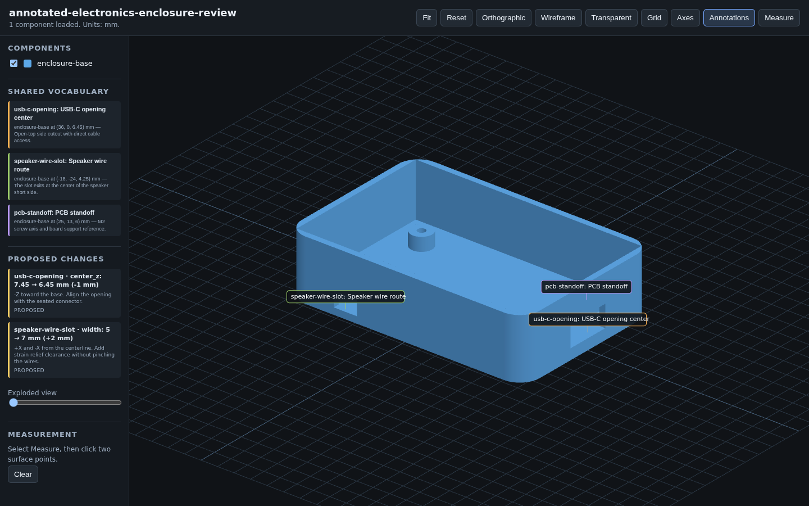
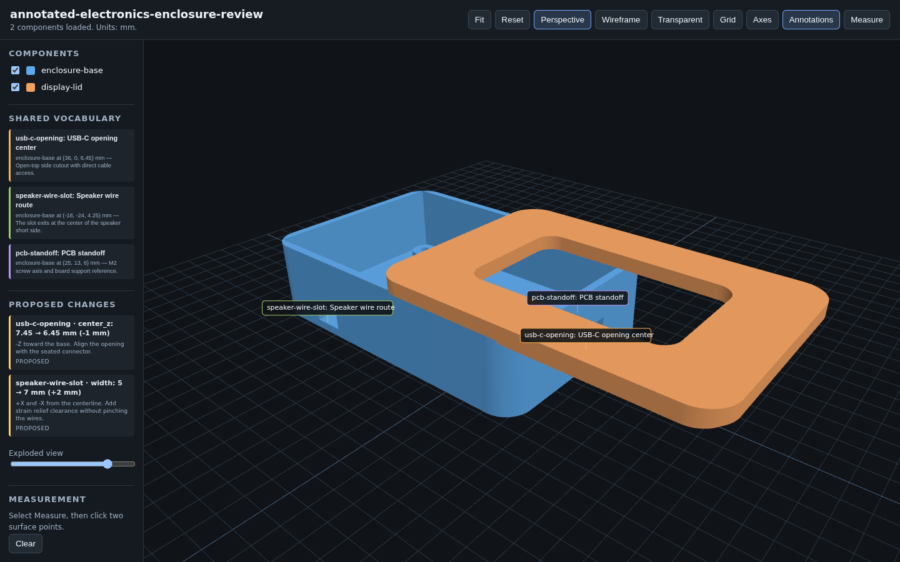

# Functional FDM Mechanical CAD

An agent skill for designing small mechanical parts that can survive contact with a real FDM printer.

The skill uses CadQuery to build editable solid models. It checks fits, assembly paths, fasteners, print orientation, unsupported geometry, and the difference between a CAD claim and a tested physical result. It produces STEP and STL files, static diagnostic renders, an annotated Three.js review page, and concise build notes.

## Annotated 3D review

The browser review gives each critical feature a stable name and shows proposed numeric changes before fabrication.



Exploded mode separates the enclosure base and display lid while it keeps their shared review labels visible.



It is meant for parts such as:

- electronics enclosures and removable covers;
- brackets, mounts, spacers, knobs, and adapters;
- press fits, sliding fits, rails, dovetails, and hinges;
- clips, detents, cantilever snaps, and latches;
- M2 through M4 fasteners, captive nuts, and heat-set inserts;
- magnet pockets and simple multipart assemblies.

Decorative mesh generation is outside its scope. Slicing, printer queues, uploads, and printer control are also outside its scope.

## What the skill changes

Most generated CAD workflows stop when a solid is valid. This skill keeps checking:

- Does the part fit the supplied dimensions?
- Can each component enter and leave along a real assembly path?
- Can a screwdriver, wire, connector, or insert tool reach its target?
- Does a bridge have support at both ends?
- Is a capture lip a hidden one-ended cantilever?
- Does the proposed print orientation put the load across weak layer interfaces?
- Does a small test preserve the fit or mechanism that it claims to test?
- Did a physical test confirm the function, or did the CAD only make it plausible?

The skill blocks a design when required evidence is missing. It records assumptions instead of presenting them as measurements.

## How it works

The agent records the known dimensions, proposes a design, checks the mechanics and FDM risks, and shows an annotated preview. It then recommends a small physical test for any uncertain fit or mechanism. It does not call a function proven until a physical test confirms it.

## Interactive review

The generated Three.js preview includes:

- orbit, pan, zoom, fit, and camera reset;
- orthographic and perspective views;
- component visibility and exploded view;
- transparent and wireframe modes;
- point-to-point measurement;
- named feature annotations;
- a proposed-change panel with before, after, signed delta, direction, reason, and approval state.

The shared coordinate vocabulary prevents camera-dependent requests such as “move the hole lower.” A revision can instead say: `usb-c-opening center_z: 7.2 → 6.2 mm, -1.0 mm in -Z toward the base`.

## How to install

The easiest way to install the skill is to paste this into ChatGPT, Claude Code, Codex, or your preferred coding agent:

```text
Install the /functional-3d-printing skill globally from https://github.com/bytespell-org/functional-3d-printing
```

## CAD runtime

The tested runtime uses Python 3.12, CadQuery 2.8.0, and a pinned `cq_warehouse` revision. Create an isolated environment:

```bash
uv python install 3.12
uv venv --python 3.12 .venv-functional-cad
uv pip install --python .venv-functional-cad/bin/python \
  cadquery==2.8.0 \
  'cq_warehouse @ git+https://github.com/gumyr/cq_warehouse.git@daa46507ecc429c0e2dce11d9d5ffd09b12a42af'
```

Copy [`assets/functional-cad-project/model.py`](assets/functional-cad-project/model.py) as the editable source for a new design. Keep generated STEP, STL, render, and preview files outside the source directory.

Run the model:

```bash
PYTHONPATH=/path/to/functional-3d-printing \
  .venv-functional-cad/bin/python \
  /path/to/functional-3d-printing/scripts/run_model.py \
  model.py \
  --output-dir /tmp/my-functional-part
```

Serve the interactive preview:

```bash
python /path/to/functional-3d-printing/scripts/serve_preview.py \
  /tmp/my-functional-part/preview \
  --host 127.0.0.1 \
  --port 0 \
  --open
```

## Credits

The source and license notes in [`references/sources-and-runtime.md`](references/sources-and-runtime.md) identify the CAD libraries and engineering references used during development.

## License

MIT. See [LICENSE](LICENSE).
